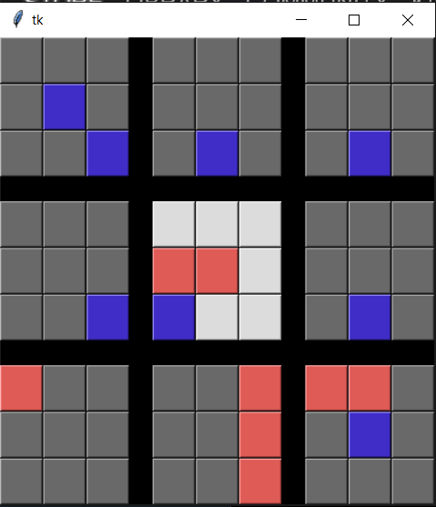

# Ultimate-Tic-Tac-Toe-Bot

### About
Ultimate Tic Tac Toe is similar to the traditional tic tac toe, but with each location itself being a tic tac toe board as well.  Instructions on the game can be found on the wikipedia page below.

https://en.wikipedia.org/wiki/Ultimate_tic-tac-toe

This is a simple program to build out different bots and test their performance against a human player.  There is a gui (only workes on Windows) to interact with the game and play against a bot!

### How to Add a Bot
Add a bot class to `bots.py` that implements `make_move()`,`set_player_id`, and has a variable `TYPE=BOT`.  Then add the class to the dictionary at the bottom of the file.  

To select a bot to versus, run `python game_gui.py` and the console will ask for the key of the bot class to instantiate.

### Current Bots Implemented

##### Random Bot
Mostly used for testing of the game system.  Randomly selects a valid move
##### Minimax Tree with Heuristic and Alpha Beta Pruning
Given the high branching factor of the game, especially when any available blank space is a valid move, a simple minimax will not complete in a timely fashion.  Even with the additiona of alpha beta pruning, the search place is too large.  To compensate, a heuristic is added that prioritizes selecting blocks to complete a 3-in-a-row or work towards that goal.

The minimax search depth increases as sections of the overarching grid are taken.  This is to reduce time spent on the first few turns, and have more time spent considering next moves when the game nears its end.

##### Monte Carlo Tree Search Bot
Implemented a preliminary version of a bot that utilizes MCTS to pick move.

###### Improvement Points
* Current simulation randomly picks a move for both the player and the opponent.  Because of this, the bot will often select a move that almost guarantees the opponent will win since the both is not considering for an 'adversarial' opponent.  Improvements can be made function used to determine score, or implement a minimizing opponent.
* State space is pretty large.  Need to find a more optimal tradeoff between exploitation and exploration.
